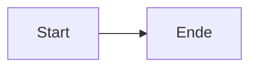
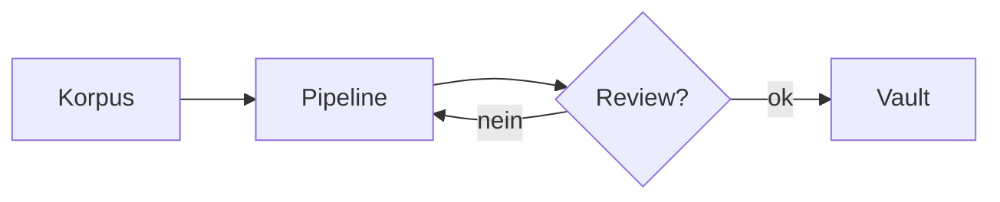
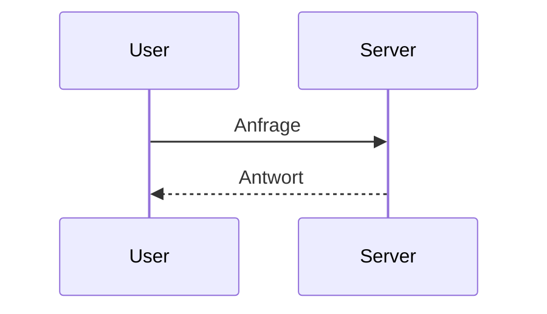
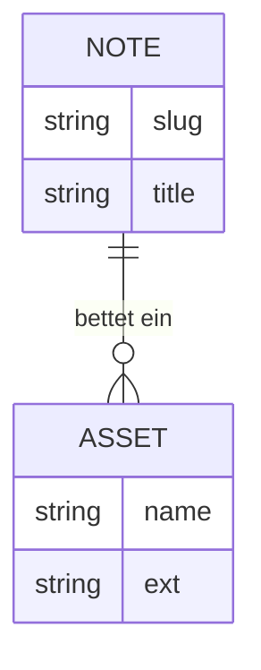
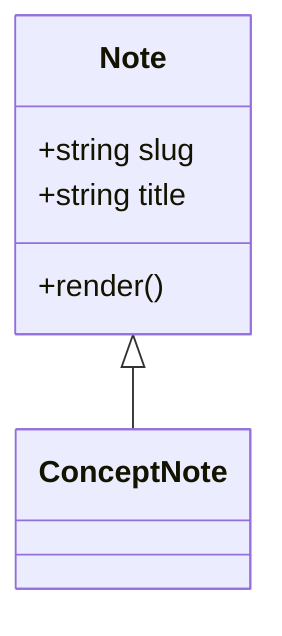
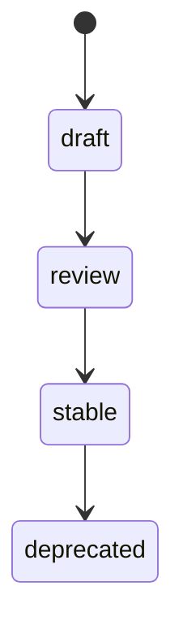

# Diagramm-Standard

> **Master-Datei.** Ziel-Ablage: `09_Brain-Vault/00_Meta/diagramm-standard.md`.
> Diese Anleitung ist eigenständig lesbar — sie braucht keine weiteren Repo-Docs.

Strukturierte Diagramme werden im Vault **ausschließlich als Mermaid** geschrieben — als Text-Codeblock direkt im Note-Body. Kein Excalidraw, keine eingebetteten Bild-Diagramme.

---

## Die eine Regel

Schreibe einen Codeblock mit dem Sprach-Tag `mermaid`:

````markdown

````

Obsidian und GitHub rendern das nativ — ohne Plugin.

---

## Warum Mermaid? (kurz)

- **Diff-bar:** Es ist Text. Änderungen sind als Zeilen-Diff sichtbar, nicht als undurchsichtiger Bild-Blob.
- **Versionierbar:** lebt mit der Note im Body, kein separater Asset im `_assets/`-Pool.
- **Kein Plugin-Lock-in:** rendert nativ in Obsidian und GitHub.

**Excalidraw wird nicht eingeführt** — es erzeugt Binär-Dateien, ist nicht diff-bar und braucht ein Plugin.

---

## Welcher Typ wofür?

| Bedarf | Mermaid-Typ |
|---|---|
| Ablauf / Fluss | `flowchart` (`graph`) |
| zeitlicher Nachrichtenaustausch | `sequenceDiagram` |
| Datenmodell / Entitäten | `erDiagram` |
| Klassen / Strukturen | `classDiagram` |
| Zustände | `stateDiagram-v2` |

---

## Copy-paste-Snippets

### Flowchart (Ablauf)

````markdown

````

### Sequence (Nachrichtenaustausch)

````markdown

````

### ER (Datenmodell)

````markdown

````

### Class (Strukturen)

````markdown

````

### State (Zustände)

````markdown

````
